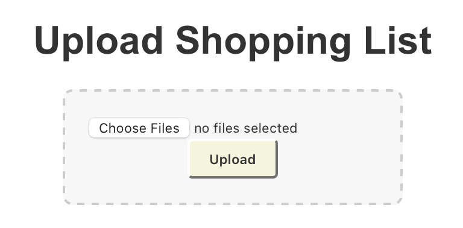

# Shopping List Web Application

This project is a full-stack web application designed to automate the retrieval of product information from shopping list(s) uploaded by the user. The application uses React, REST API, and Apache Kafka, along with other technologies.

## Features

- **File Upload**: Users can upload a shopping list in file format.
- **Real-Time Data Processing**: The uploaded file is processed line by line, and each item is sent as a message to an Apache Kafka topic.
- **Web Scraping**: The system uses a web scraper to gather product details from the store's website for each item.
- **Backend Integration**: Once messages from the topic are consumed and their product details are gathered, the application sends the data to the backend, where it is saved and available for display.
- **Frontend Display**: The React frontend fetches the product details from the backend and displays them to the user.

## Workflow

1. **Frontend Interaction**:  
   The user uploads a shopping list file through the React frontend.



2. **File Upload**:  
   A POST request is sent to the backend with the uploaded file.

3. **File Handling**:  
   The backend stores the uploaded file in the `input` folder of the local directory.

4. **File Processing**:  
   A service listens for new files in the `input` folder. When a new file is detected, it triggers the file processor service.

5. **Message Production**:  
   The file processor service breaks the file into individual messages (one per line) and sends these messages to a Kafka topic using a Kafka message producer.

6. **Message Consumption**:  
   The Kafka message consumer listens for messages from the Kafka topic and processes them as they arrive.

7. **Message Processing**:  
   Upon receiving a message, the message processor service creates a product and uses the web scraper to extract relevant product details.

8. **Backend Update**:  
   The message processor sends a PUT request with the extracted product information to the backend.

9. **Frontend Display**:  
   The frontend fetches the product information from the backend and displays it to the user.

## Technologies Used

- **Frontend**: React
- **Backend**: REST API, Spring Boot, Spring MVC
- **Real-Time Messaging**: Apache Kafka
- **Web Scraping**: Jsoup (Java library for HTML parsing and extraction)

## Setup Instructions

### Prerequisites

- Apache Kafka (for message handling)

### Installation

1. Clone the repository:
   ```bash
   git clone <repository_url>
   cd <project_directory>
   ```

2. Install dependencies for both frontend and backend:
   ```bash
   npm install
   ```

3. Set up Apache Kafka and ensure the topic is configured.

4. Run the backend (`src/main/java/com/activity/product_scout/ProductScoutApplication.java`):

5. Run the frontend:
   ```bash
   cd product-display
   npm start
   ```

6. Upload a shopping list file through the frontend, and the application will handle the rest.
